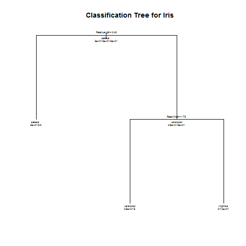

## Motivation

One of the hottest data science problem is __classification__.

To predict the species of Iris flower, a classification tree model is developed.

And users can input their observation, the apps will return the species.

--- .class #id 

## Data Summary
Here is the summary of data used to train the model

```r
data(iris)
d2=iris
species=levels(d2$Species)
summary(d2)
```

```
##   Sepal.Length   Sepal.Width    Petal.Length   Petal.Width 
##  Min.   :4.30   Min.   :2.00   Min.   :1.00   Min.   :0.1  
##  1st Qu.:5.10   1st Qu.:2.80   1st Qu.:1.60   1st Qu.:0.3  
##  Median :5.80   Median :3.00   Median :4.35   Median :1.3  
##  Mean   :5.84   Mean   :3.06   Mean   :3.76   Mean   :1.2  
##  3rd Qu.:6.40   3rd Qu.:3.30   3rd Qu.:5.10   3rd Qu.:1.8  
##  Max.   :7.90   Max.   :4.40   Max.   :6.90   Max.   :2.5  
##        Species  
##  setosa    :50  
##  versicolor:50  
##  virginica :50  
##                 
##                 
## 
```

--- 

## Classification tree
We use the classification tree to build the model from package `rpart`.


```r
library(rpart)
fit = rpart(Species~., method="class", data=d2)
plot(fit, uniform=TRUE, main="Classification Tree for Iris")
text(fit, use.n=TRUE, all=TRUE, cex=.4)
```

 

--- 

## Example
When the user input the value (1,5,2,3), the outcome of the following will shown:


```r
input = data.frame(1,5,2,3)
names(input)= c("Sepal.Length","Sepal.Width","Petal.Length","Petal.Width")

pred = predict(fit, input)
predName = species[which.max(pred)]
```

The outcome will be setosa.
 
